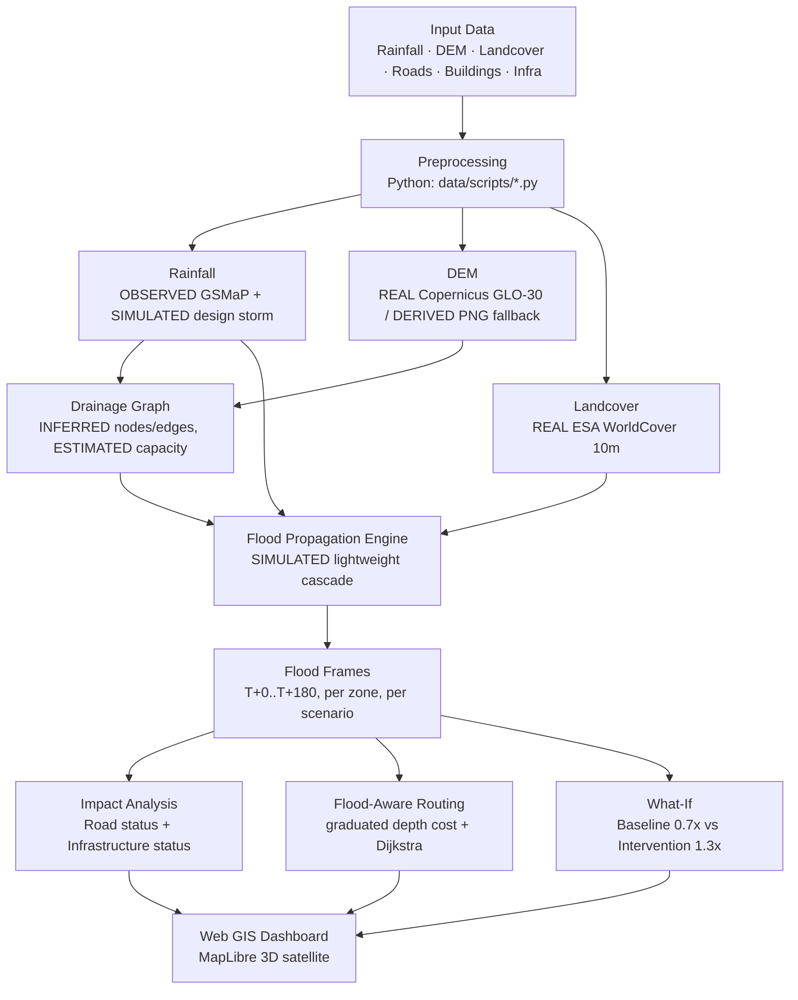
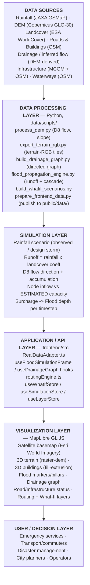
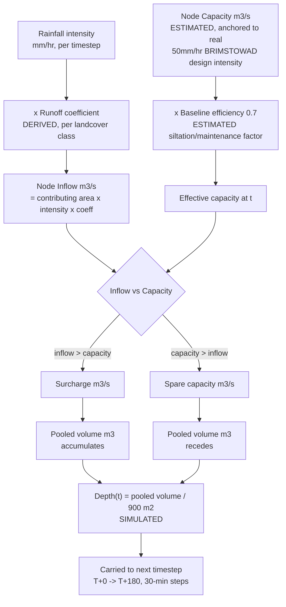
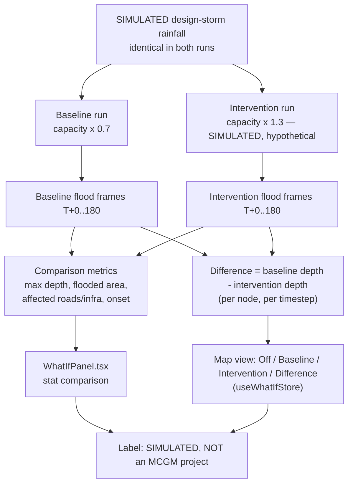
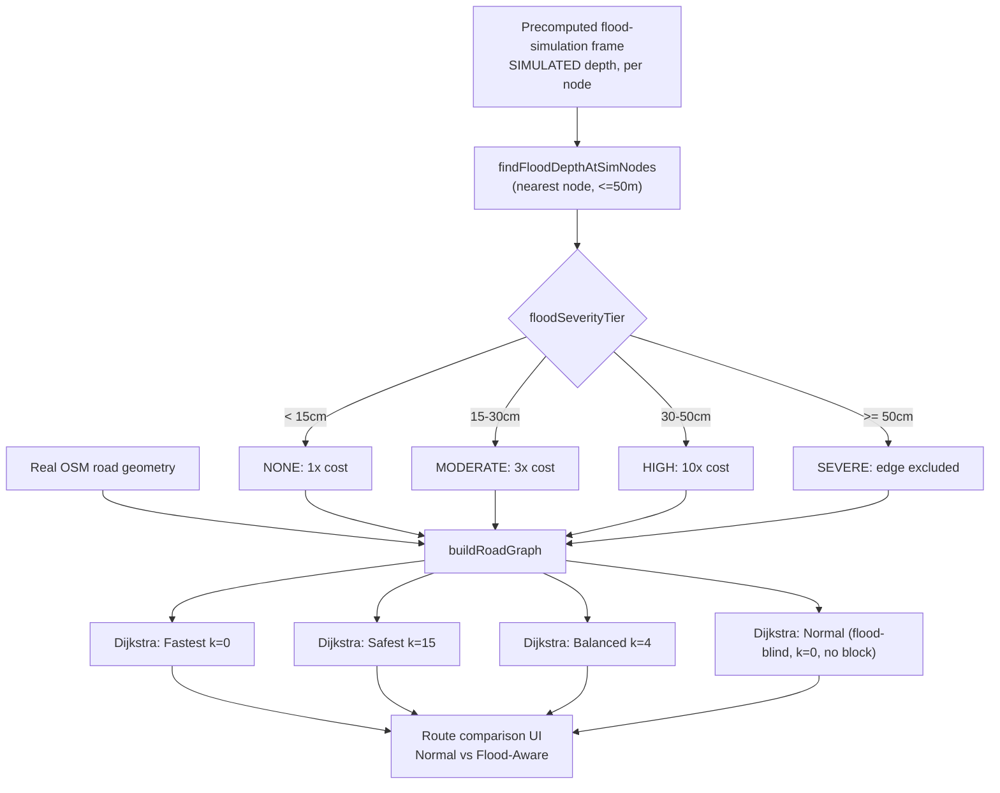
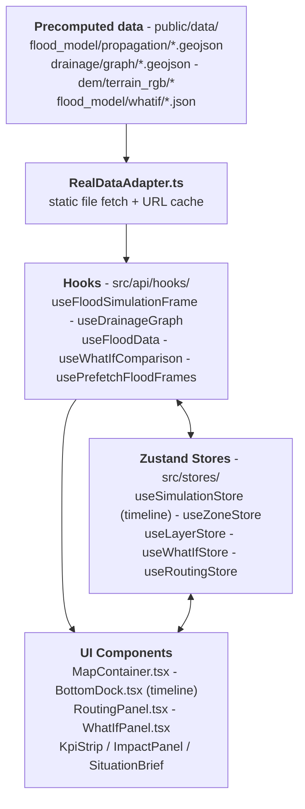

# FLOODWATCH
## Urban Flood Nowcasting & Decision Support System

**Smart India Hackathon — Problem Statement 26085**
*Urban Flood Nowcasting System (Drainage and Rainfall Coupling)*

**Organization:** Ministry of Earth Sciences (MoES)
**Department:** National Centre for Medium Range Weather Forecasting (NCMRWF)
**Category:** Software · **Theme:** Disaster Management

**Pilot Zones:**
1. Kurla–Sion–Chunabhatti
2. Hindmata–Dadar–Parel

**Team/Project Information:** Not specified in the repository — no team roster, member names, or institutional affiliation file was found in the project source. This report does not invent one.

**Report version:** Generated from a direct inspection of the FLOODWATCH repository (`SIH26085-main/`) as it exists at the time of writing, including its own prior audit reports (`AUDIT_REPORT.md`, `FINAL_IMPLEMENTATION_REPORT.md`, `DRAINAGE_INVESTIGATION_REPORT.md`, `PERFORMANCE_REPORT.md`, and others) and the working Python/TypeScript source.

---

## Table of Contents

1. Cover Page
2. Executive Summary
3. Problem Statement
4. Motivation
5. Objectives
6. Proposed Solution
7. System Overview
8. System Flow Diagram
9. System Architecture
10. Data Sources & Provenance
11. DEM Pipeline
12. Drainage Graph
13. Flood Propagation Model
14. Time Model
15. Scenarios
16. What-If Analysis
17. Flood Visualization
18. Road Impact Model
19. Infrastructure Impact
20. Flood-Aware Routing
21. Frontend Architecture
22. Map Architecture
23. Performance Optimization
24. Testing & QA
25. Final Audit Results
26. SIH 26085 Requirement Mapping
27. Validation
28. Security / Reliability / Failure Handling
29. Limitations
30. Future Enhancements
31. Demo Workflow
32. Judge Q&A Preparation
33. Conclusion
34. Appendices

---

## 2. Executive Summary

FLOODWATCH is a prototype urban flood nowcasting and decision-support dashboard built for two bounded pilot zones in Mumbai — Kurla–Sion–Chunabhatti and Hindmata–Dadar–Parel. It answers the SIH 26085 brief's central question — "will rain translate into street-level flooding, and where?" — by coupling four real data layers (rainfall, terrain, drainage, land cover) through a documented, lightweight computational pipeline, then surfacing the result as an interactive 3D satellite map with flood depth, road/infrastructure impact, flood-aware routing, and a baseline-vs-intervention what-if comparison.

The system is explicitly **not** a hydrodynamic flood model and does not claim to be one. It is a transparent, DEM-derived directed drainage graph (nodes = pour points, edges = D8 flow paths) with an estimated per-node hydraulic capacity, driven by a rainfall hyetograph and a landcover-derived runoff coefficient, producing a depth estimate at each of seven canonical timesteps (T+0 through T+180 minutes, in 30-minute steps). Every number the system produces is tagged with one of six provenance levels — REAL, OBSERVED, DERIVED, INFERRED, ESTIMATED, or SIMULATED — and the UI, the underlying data files, and this report all use that same vocabulary consistently.

The frontend is a React + TypeScript + MapLibre GL JS single-page application with no live backend: all modeling happens offline in Python and is served as static GeoJSON/JSON/PNG files, an architecture chosen deliberately for reliability, offline-safety, and demo predictability. The map uses a Google Earth-style tilted 3D satellite basemap (Esri World Imagery, keyless), MapLibre-native 3D terrain and building extrusion (no Cesium), and a set of flood-analysis overlays — flood depth markers/pillars, the drainage graph, rainfall intensity, road and infrastructure status, and a flood-aware routing engine with a Normal-vs-Flood-Aware comparison.

The project's own internal audits (`FINAL_IMPLEMENTATION_REPORT.md`) describe it honestly as *"ready as an honest data-integration and command-center prototype... not as a validated flood-prediction system."* This report does not depart from that assessment.

---

## 3. Problem Statement

**SIH Problem Statement 26085 — Urban Flood Nowcasting System (Drainage and Rainfall Coupling)**, posed by the Ministry of Earth Sciences / NCMRWF, observes that urban flooding in metros like Mumbai, Delhi, and Chennai is a hyper-local phenomenon driven by micro-topography, impervious surfaces, and overloaded drainage — one that traditional Numerical Weather Prediction (NWP) models cannot resolve, because knowing *how much* rain will fall does not translate into knowing *where the streets will flood*.

The brief calls for a **high-resolution, real-time urban flood nowcasting system with a 0–3 hour lead time**, built as a **coupled framework** fusing:

- high-resolution rainfall nowcasts (ideally from Doppler Weather Radar),
- a high-resolution Digital Elevation Model (DEM), and
- the city drainage network,

so that the system can trace how water flows, accumulates, enters drainage, overloads it, surcharges, and returns to the surface — ultimately pinpointing **which streets and intersections** are likely to flood, supporting **flood-safe routing** and a **dynamic Web GIS dashboard** for decision support. The PS explicitly permits historical/observed or synthetic rainfall for prototype purposes, provided it is clearly labelled as such and never presented as a live radar nowcast — and explicitly discourages building a full research-grade 2D hydrodynamic solver, asking instead for a lightweight, interpretable, drainage-aware simulation.

---

## 4. Motivation

**Urban flooding** in a city like Mumbai is not simply a function of total rainfall — it is a function of *rainfall intensity* interacting with *terrain* (where water naturally pools), *impervious land cover* (how much of that rain becomes runoff rather than infiltrating), and *drainage capacity* (how much of that runoff the city's pipes and nallas can actually carry away before they surcharge and push water back onto the street).

When any one of these fails — an intense burst exceeds the drainage system's design capacity, or a low-lying road sits exactly where surface flow converges — the result is street-level flooding that can happen block-by-block rather than city-wide, which is exactly why coarse rainfall forecasts alone are insufficient. Flooded roads and intersections in turn disrupt **road and infrastructure access**: hospitals, fire stations, and police stations can become unreachable at precisely the moment they are needed most, and commuters and emergency vehicles need to know *now*, not after the fact, which routes are safe. This is why the PS frames the requirement around a **0–3 hour prediction window** — long enough to act (reroute traffic, pre-position emergency resources, warn residents) but short enough to be operationally meaningful, unlike a 24-hour categorical forecast.

---

## 5. Objectives

1. Ingest real rainfall, terrain, and land-cover data for two bounded Mumbai pilot zones and keep every dataset's provenance explicit and auditable.
2. Represent the pilot-zone drainage network as an explicit **directed graph** (nodes and edges), acknowledging that the official MCGM underground network is unavailable, and deriving a defensible INFERRED substitute from the DEM instead.
3. Implement a **lightweight, interpretable** flood-propagation model — rainfall → runoff → drainage-graph capacity check → surcharge → local depth — that produces results at the PS-mandated T+0…T+180-minute cadence, without claiming to be a full hydrodynamic solver.
4. Surface flood depth, road status, and infrastructure impact on an interactive map, at a resolution honest about what the underlying model can actually support (drainage-graph-node resolution, not per-street hydrodynamics).
5. Provide **flood-aware emergency routing** that measurably avoids simulated flooded roads, with a visible comparison against a flood-blind "normal" route.
6. Provide at least one **what-if scenario** (baseline vs. a hypothetical drainage-capacity intervention) so the tool can be used to reason about interventions, while being explicit that no such intervention is actually planned or funded by MCGM.
7. Never fabricate a dataset, credential, accuracy metric, or real-time claim not backed by an actual data source or computation in the repository.

---

## 6. Proposed Solution

FLOODWATCH couples four real inputs — **rainfall** (JAXA GSMaP satellite-derived), **terrain** (Copernicus DEM GLO-30), **land cover** (ESA WorldCover 10m), and an **INFERRED drainage graph** (derived from the same DEM, since the official MCGM network is confirmed unpublished) — through a documented Python pipeline that produces, for each pilot zone and each of two rainfall scenarios (a real observed window and a SIMULATED design storm), seven timestep frames (T+0 to T+180 minutes) of per-node flood depth. Those frames drive: a MapLibre-based 3D satellite dashboard; categorical road status (NORMAL/WATCH/FLOODED/HIGH RISK) and infrastructure status (SAFE/AT RISK/CRITICAL); a flood-aware routing engine with graduated depth-based cost penalties; and a baseline-vs-drainage-intervention what-if comparison. The entire frontend is a static single-page application with no live backend — every number is either fetched from a precomputed file or computed client-side from one, which keeps the system reliable, fast, and fully reproducible for a live demo.

---

## 7. System Overview

The system implements the following conceptual pipeline, matching the PS's own structure:

```
Rainfall Input
      ↓
Rainfall Processing / Temporal Resampling
      ↓
DEM + Landcover
      ↓
Runoff Estimation
      ↓
Surface Flow / D8 Flow
      ↓
Drainage Graph
      ↓
Hydraulic Capacity Estimation
      ↓
Overcapacity / Surcharge
      ↓
Flood Depth
      ↓
Road & Infrastructure Impact
      ↓
Flood-Aware Routing
      ↓
What-If Intervention Analysis
      ↓
GIS Dashboard
```

**Rainfall Input** — Real JAXA GSMaP V8 gauge-calibrated hourly rainfall for the acquired window (2026-09-06), OBSERVED, at 0.1°(~11km) resolution — city-level, coarser than the pilot zone. For demonstration, a SIMULATED design-storm hyetograph is also defined, peaking at MCGM's own REAL published BRIMSTOWAD-1993 design intensity (50mm/hr).

**Rainfall Processing / Temporal Resampling** — The frontend's timeline (`lib/timeline.ts`) resamples whatever real hourly rainfall series is available down to exactly the 7 canonical T+0/30/60/90/120/150/180-minute offsets by nearest-real-reading lookup — every timestamp shown is a real reading, never invented, and no matter how many rows the acquired window contains, the UI's timeline is always this exact cadence.

**DEM + Landcover** — Real Copernicus DEM GLO-30 (elevation) and ESA WorldCover 10m (land cover), the terrain and surface-type inputs for everything downstream.

**Runoff Estimation** — Each drainage-graph node's landcover class (exactly decoded from the tracked WorldCover PNG's fixed palette — not a lossy re-derivation) is mapped to a DERIVED, literature-typical runoff coefficient (e.g. Built-up=0.85, Tree cover=0.15, Water=1.00 — see §13).

**Surface Flow / D8 Flow** — The same D8 steepest-descent + flow-accumulation algorithm used elsewhere in the project (`process_dem.py`, unit-tested via `--selftest`) is run on each zone's own elevation grid to determine INFERRED flow direction and contributing area per cell.

**Drainage Graph** — D8 flow paths above a per-zone contributing-cell threshold become a directed graph: nodes are pour points, edges are flow segments, both INFERRED from the DEM. This is explicitly **not** the official MCGM underground network (see §12).

**Hydraulic Capacity Estimation** — Each edge/node gets an ESTIMATED capacity, anchored to MCGM's own REAL published 50mm/hr BRIMSTOWAD design intensity applied to its DEM-derived contributing catchment — not a measured pipe diameter (none exist for this area).

**Overcapacity / Surcharge** — At each timestep, inflow (rainfall × runoff coefficient × contributing area) is compared to capacity; the excess is surcharge, and a documented ESTIMATED baseline drainage efficiency (0.7×) is applied to represent real-world siltation/maintenance deficit — otherwise inflow and capacity would be calibrated to the same number and the model could never demonstrate a surcharge at all.

**Flood Depth** — Surcharge volume pools locally over a documented ESTIMATED nominal footprint per node (900 m²), persisting and receding across timesteps as capacity draws down any backlog — a SIMULATED "lightweight drainage-graph cascade," not a 2D hydrodynamic solve.

**Road & Infrastructure Impact** — Real road/infrastructure geometry is enriched, per timestep, with the nearest drainage-graph node's SIMULATED depth, producing categorical status (NORMAL/WATCH/FLOODED/HIGH RISK for roads; SAFE/AT RISK/CRITICAL for infrastructure).

**Flood-Aware Routing** — A real Dijkstra-based router over the real OSM road graph applies a graduated, depth-tiered cost penalty (see §20) so that fastest/safest/balanced routes all avoid or heavily penalize simulated flooding, compared against a flood-blind "normal" route.

**What-If Intervention Analysis** — The identical pipeline is re-run twice with different ESTIMATED capacity multipliers (0.7× "baseline/today" vs. 1.3× "hypothetical intervention") to produce a SIMULATED before/after comparison — never presented as an actual MCGM project.

**GIS Dashboard** — All of the above is rendered in a MapLibre GL JS 3D satellite dashboard with a full timeline scrubber, layer toggles, and decision-support panels.

---

## 8. System Flow Diagram — DIAGRAM 1: High-Level System Flow



---

## 9. System Architecture — DIAGRAM 2: Detailed Technical Architecture



---

## 10. Data Sources & Provenance

| Dataset | Purpose | Source | Resolution / Coverage | Processing | Provenance | Limitations |
|---|---|---|---|---|---|---|
| GSMaP V8 Gauge-calibrated rainfall | Rainfall intensity input | JAXA EORC (FTP) | 0.1°(~11km); acquired window 2026-09-06, hourly | Processed to per-zone hourly CSV | **REAL / OBSERVED** | Acquired 24h window is genuinely dry (0.0mm/hr both zones) — a real finding, not a defect; resolution is city-level, coarser than the pilot zone |
| Copernicus DEM GLO-30 | Elevation / terrain | OpenTopography | 30m; Greater Mumbai | Priority-flood filled, D8 flow direction/accumulation | **REAL** (raw) / **DERIVED** (filled, slope, flow) | DSM (includes buildings/vegetation, not bare-earth); raw raster is gitignored/regenerable and was **absent** in the deployed environment during Phase 1–3 work, so a **DERIVED PNG-decode fallback** (re-decoding the tracked visualization PNG via its documented invertible color ramp) was used — flagged in every output that used it |
| ESA WorldCover 10m v200 (2021) | Land cover / runoff coefficient basis | ESA / VITO | 10m; Greater Mumbai | Clipped per zone, exact palette decode | **REAL** | "Built-up" is one coarse class, not a calibrated impervious-surface percentage |
| OSM road network (pilot zone, full attributes) | Routing graph, road status | OpenStreetMap (Overpass) | Vector; both pilot zones | Simplified for frontend delivery | **REAL** | One-way/lanes/maxspeed tagging completeness varies (OSM gap, not fabricated) |
| OSM building footprints | 3D building extrusion | OpenStreetMap (Overpass) | Vector polygon; both pilot zones | Height: REAL where tagged, DERIVED (levels×3m) or a flat non-official 6m default otherwise | **REAL** (footprint) / **DERIVED** (height) | Most buildings in these zones have no height tag at all |
| Inferred surface drainage (city-wide) | Original DEM-derived stream network | Self-generated (`process_dem.py`) from Copernicus DEM | 30m; city-wide, threshold ≥50 cells | D8 + flow accumulation | **INFERRED** | Too sparse inside either 5.5km pilot zone (0–12 segments) — superseded for drainage-graph purposes by a zone-native re-run (see §12) |
| Directed drainage graph (per zone) | Routing/flood-model backbone | Self-generated (`build_drainage_graph.py`) | ~37m node spacing; 396 nodes/300 edges (Kurla-Sion), 179 nodes/118 edges (Hindmata-Dadar) | D8 on zone-native 150×150 grid, threshold ≥10 cells | **INFERRED** (geometry/flow) / **ESTIMATED** (capacity) | **Not the official MCGM underground network** — confirmed absent from all 136 MCGM ArcGIS services checked |
| MCGM official infrastructure (health, fire, police, metro, rail) | Critical-infrastructure locations | MCGM ArcGIS FeatureServer | Point; Greater Mumbai | Clipped per zone | **REAL / OFFICIAL** | Health facilities layer publishes only 4 city-wide records (a curated subset) |
| OSM supplemental infrastructure (schools, bridges, substations) | Additional infrastructure categories with no confirmed MCGM layer | OpenStreetMap (Overpass) | Point/line; both pilot zones | — | **REAL** | Substation voltage/capacity tags are patchy |
| Open nallas / waterways | Real surface water context | OpenStreetMap (Overpass) | Vector; Greater Mumbai | — | **REAL** | Minor/informal drains incompletely mapped in OSM; this is **not** a substitute for the underground network |
| MCGM SWD official aggregate statistics | Real published design criteria (used to anchor capacity ESTIMATES) | MCGM Chief Engineer (SWD) RTI Manual | Non-spatial, city/region totals | Digitized from PDF | **OFFICIAL** | No coordinates/geometry — never rendered as spatial data |
| India Flood Inventory v3 | Historical flood event index | Zenodo | Event-level, national | Filtered to Mumbai-specific events | **REAL** | Event index only, not a continuous flood-extent layer |
| Sentinel-1 SAR GRD | Flood-extent validation (attempted) | Copernicus Data Space | 10m | Auth/search/partial-download only | **PARTIAL** | See §27 — IoU/F1/accuracy were **never computed** |
| Terrain-RGB tiles (per zone) | MapLibre 3D terrain source | Self-generated (`export_terrain_rgb.py`) from the DEM above | z12–14, 57 tiles (Kurla-Sion) / 53 tiles (Hindmata-Dadar) | Mapbox terrain-RGB encoding | **DERIVED** | Precision note carried per zone: full-precision when the raw DEM is present, reduced-precision PNG-decode fallback otherwise (both zones currently use the fallback — `fallback_used: true`) |
| Esri World Imagery / Reference labels | Satellite/hybrid basemap | Esri (ArcGIS Online, public/keyless) | Global raster tiles | Used as-is via MapLibre raster source | **REAL** (third-party imagery, not project-derived) | Attribution required and shown on-map; no API key exists or is needed in this project |

---

## 11. DEM Pipeline

**Source.** Copernicus DEM GLO-30, acquired via OpenTopography for the Greater Mumbai bounding box (72.75–73.05°E, 18.85–19.30°N), 30m resolution.

**Preprocessing (`data/scripts/process_dem.py`).** The raw DEM is hydrologically conditioned via priority-flood depression filling (Barnes et al. 2014 algorithm), then D8 steepest-descent flow direction and flow accumulation are computed pixel-by-pixel. This produces filled elevation, slope (degrees), flow direction, and flow accumulation rasters, plus a city-wide INFERRED surface-flow stream network (thresholded at ≥50 contributing cells, 9,717 segments). The algorithm is unit-tested (`process_dem.py --selftest`) against a synthetic tilted-plane fixture before ever touching real data.

**Fallback (real, documented, not fabrication).** The raw DEM GeoTIFF is intentionally gitignored (regenerable, requires `OPENTOPOGRAPHY_API_KEY`) and was **absent** in the environment used for Phases 1–9 of this project's development. Rather than block or fabricate, `data/scripts/dem_source.py` re-decodes the tracked elevation visualization PNG (`mumbai_elevation.png`) via its documented, exactly-invertible color ramp (the R channel of `export_dem_visuals.py`'s `ELEVATION_CMAP` is strictly monotonic across all 6 stops). This is real-data recovery, not invention — but it is explicitly lower precision (8-bit-quantized, capped at 100m) and every output that uses it carries `"fallback_used": true` and a `precision_note` saying so. Both pilot zones' terrain-RGB manifests currently show `fallback_used: true`.

**Terrain-RGB generation (`export_terrain_rgb.py`).** For each pilot zone, elevation is sampled onto a 512×512 grid, then re-projected per output XYZ tile (zoom 12–14) and Mapbox-RGB-encoded (`height = -10000 + (R·65536 + G·256 + B)·0.1`). Output: 57 tiles for Kurla-Sion, 53 for Hindmata-Dadar, ~828KB total — deliberately zone-scoped, never city-wide.

**MapLibre `raster-dem` + 3D terrain visualization.** The frontend adds a `raster-dem` source from these tiles and calls `map.setTerrain({ source, exaggeration: 1.5 })` — MapLibre-native, no Cesium — **only** when `viewMode === 'zone'` and the "3D Terrain" layer toggle is on, so the city overview never loads detailed terrain.

---

## 12. Drainage Graph

**Structure.** Per the PS's explicit requirement, drainage is represented as a **directed graph**: nodes are manhole/inlet/junction-equivalent pour points, edges are pipe/drain-equivalent flow connections.

**How it is built (`data/scripts/build_drainage_graph.py`).** Rather than reuse the city-wide inferred stream network (which turned out to intersect one pilot zone in only 12 short segments and the other in **zero** — real DEM output, just tuned at the wrong scale for a 5.5km box), the same D8 + flow-accumulation algorithm is re-run directly on each zone's own 150×150 elevation grid. Cells whose flow accumulation reaches at least 10 contributing cells become graph edges; their endpoints, snapped to a shared coordinate grid, become nodes. This produces **396 nodes / 300 edges** for Kurla-Sion-Chunabhatti and **179 nodes / 118 edges** for Hindmata-Dadar-Parel — full, real coverage in both zones using the identical, already-unit-tested method, at roughly 37m node spacing.

**Direction.** Each edge's direction is the real D8 steepest-descent direction on the (real or DERIVED-fallback) DEM — INFERRED, not assumed.

**Node roles.** Each node is tagged `headwater` (no incoming edge), `sink` (no outgoing edge — the zone's own local drainage-graph terminus, not "zero capacity"), or `junction`.

**Capacity (ESTIMATED, not measured).** Every edge and node carries a capacity in m³/s computed as:

```
capacity_m3s = contributing_area_m2 × design_intensity_m_s × runoff_coeff
             = (flow_accumulation_cells × 30² m²) × (50mm/hr ÷ 1000 ÷ 3600) × 1.0
```

anchored to **MCGM's own real, published post-BRIMSTOWAD-1993 design criterion** (50mm/hr rainfall intensity, runoff coefficient 1.0 — `mcgm_swd_official_statistics.json`), not an invented pipe diameter. A sink node with no outgoing edge inherits the maximum capacity among its incoming edges (fixed during QA — see §25 — after an earlier version assigned sinks 0 capacity, which made every sink flood unboundedly regardless of rainfall).

**⚠️ Explicit statement of provenance.** *The drainage graph implemented in this project is INFERRED from a Digital Elevation Model. It is a DEM-derived surface-flow approximation, not the official MCGM underground stormwater drainage network. A full investigation (`DRAINAGE_INVESTIGATION_REPORT.md`) confirmed the official network is not published on any of MCGM's public ArcGIS REST services (136 checked) and can only be obtained via a formal SWD department request or RTI. This graph is never presented as, merged with, or mislabeled as that official network.*

---

## 13. Flood Propagation Model

Implemented in `data/scripts/flood_propagation_engine.py`, explicitly scoped as a **"lightweight drainage-graph surcharge cascade,"** not a 2D hydrodynamic solver — matching the PS's own instruction not to build a full research-grade solver.

**Step 1 — Rainfall.** Two scenarios exist (see §15): a real observed hourly series, and a SIMULATED design-storm hyetograph `[5, 25, 50, 35, 20, 10, 5]` mm/hr at T+0…T+180, peaking at MCGM's real 50mm/hr design intensity.

**Step 2 — Runoff coefficient (DERIVED, per ESA WorldCover class at each node):**

| Class | Coefficient |
|---|---|
| Built-up | 0.85 |
| Tree cover | 0.15 |
| Shrubland | 0.20 |
| Grassland | 0.25 |
| Cropland | 0.30 |
| Bare/sparse vegetation | 0.40 |
| Permanent water bodies | 1.00 |
| Herbaceous wetland | 0.60 |
| Mangroves | 0.50 |
| Moss/lichen | 0.30 |
| Unmapped fallback | 0.50 |

These are documented literature-typical assumptions, not measured municipal coefficients, and distinct from the *design* coefficient (1.0) used for capacity in §12.

**Step 3 — Inflow at each node:**

```
inflow_m3s = contributing_area_m2 × rainfall_intensity_m_s × runoff_coeff
contributing_area_m2 = max(incoming-edge flow_accumulation_cells) × 30² m²
```

**Step 4 — Capacity check and surcharge:**

```
capacity_m3s(t) = node_capacity_m3s × capacity_multiplier
surcharge_m3s   = max(0, inflow_m3s − capacity_m3s)
spare_capacity  = max(0, capacity_m3s − inflow_m3s)
```

`capacity_multiplier` defaults to **0.7** (`BASELINE_DRAINAGE_EFFICIENCY`) for the standard demo run — a documented ESTIMATE representing real-world siltation/maintenance deficit (the PS's own "heavily strained" drainage framing), since at exactly the design intensity, capacity and inflow would otherwise be calibrated to the same number and the model could never demonstrate a surcharge at all.

**Step 5 — Local pooling and recession:**

```
net_volume_change_m3 = (surcharge_m3s − spare_capacity_m3s) × 1800s
pooled_volume_m3(t)  = max(0, pooled_volume_m3(t−1) + net_volume_change_m3)
depth_m(t)            = pooled_volume_m3(t) / 900 m²   (NODE_BASIN_AREA_M2, ESTIMATED)
```

Depth accumulates when the node is overwhelmed and recedes when spare capacity exists to drain the backlog — a documented ESTIMATED nominal footprint (900 m² per node) stands in for a true 2D ponding-extent solve.

**Depth bins (display, per the PS's own categories):** 0–15cm / 15–30cm / 30–50cm / 50–100cm / >100cm.

**Observed result (design storm, Kurla-Sion):** depth rises to a peak of 0.40m at T+60min (matching the rainfall peak), with 144 of 396 nodes flooded, then recedes to 0 by T+120min — a believable, bounded pulse tied directly to the rainfall input, not a runaway artifact.

---

## DIAGRAM 3: Flood Modelling Pipeline



---

## 14. Time Model

The canonical timeline is exactly **T+0, T+30, T+60, T+90, T+120, T+150, T+180 minutes** (`FLOOD_TIMESTEPS_MIN` in `types/floodSimulation.ts`, matching `TIMESTEPS_MIN` in the Python engine). This directly implements the PS's 0–3 hour lead-time requirement at a demonstrable, fixed 30-minute cadence. Every part of the application — the flood-simulation frames, the drainage-graph node status, road/infrastructure impact, the routing engine's flood-cost input, and the What-If comparison — reads from this same 7-step timeline, so "now" always means the same instant everywhere in the UI. The frontend resamples whatever real rainfall series is available down to these exact 7 offsets by nearest-real-reading lookup (`lib/timeline.ts`), rather than showing however many raw hourly rows happen to exist.

This window matters because 0–3 hours is long enough for genuine action — rerouting, pre-positioning emergency resources, issuing localized warnings — while still being short enough that a nowcast (as opposed to a multi-day forecast) is actually meaningful and skillful.

---

## 15. Scenarios

| Scenario | Rainfall input | Provenance | Purpose |
|---|---|---|---|
| **observed** | Real GSMaP hourly rainfall for the acquired window (uniformly 0.0mm/hr — a genuine dry period) | **OBSERVED** | Honest baseline; the acquired window has nothing to show, which is itself disclosed rather than hidden |
| **design_storm** | `[5, 25, 50, 35, 20, 10, 5]` mm/hr hyetograph, peak = MCGM's real 50mm/hr BRIMSTOWAD design intensity | **SIMULATED** | The scenario actually used to drive the map's flood layer, routing, and road/infra impact by default, since the real window is dry |
| **whatif_baseline** | Same design-storm rainfall, capacity × 0.7 | **SIMULATED** | "Today's condition" — drains at estimated real-world efficiency |
| **whatif_intervention** | Same design-storm rainfall, capacity × 1.3 | **SIMULATED** | Hypothetical capacity restoration + expansion — **not** an actual MCGM project |

A separate, pre-existing "Scenario Mode" (rainfall multiplier / drainage blockage sliders) also exists in the app, driving a different, older mock flood-extent formula used for the interactive polygon flood-fill layer and as a fallback for routing before the precomputed frame loads. It is intentionally kept alongside, not merged with, the four scenarios above.

---

## 16. What-If Analysis

Implemented in `data/scripts/build_whatif_scenarios.py` and surfaced in `WhatIfPanel.tsx`.

**Baseline vs. Intervention.** Both runs use the identical SIMULATED design-storm rainfall; only the drainage-capacity multiplier differs: **0.7×** (baseline, "today's condition") vs. **1.3×** (a hypothetical intervention — restored maintenance plus expanded capacity). Both multipliers are documented, round-number ESTIMATES, not measured before/after engineering figures.

**Comparison metrics** (computed per zone, at the peak-depth timestep of each run):

- Maximum flood depth
- Peak flooded node count and an ESTIMATED flooded area (node count × 900 m² footprint)
- Affected roads (real road midpoints within 40m of a flooded node) — a small sample plus a count
- Affected infrastructure (same 40m proximity rule)
- Flood onset time (first timestep with any flooded node)

**Observed result (Kurla-Sion):** baseline floods 11 real roads with a 0.40m peak depth; the intervention **eliminates all flooding** in this scenario (0 roads affected) — a clean, demonstrable before/after story.

**Difference map.** The frontend's `useWhatIfStore` supports four map views — **Off / Baseline / Intervention / Difference** — the last of which recomputes, per node and per timestep, `baseline_depth − intervention_depth` (always ≥0, since intervention only ever increases capacity) and renders it through the same ironbow depth ramp, visually showing "how much flooding this hypothetical fixes."

**Explicit labeling.** Every screen showing a what-if result carries the label *"SIMULATED — hypothetical drainage-capacity comparison for demonstration. NOT a planned or funded MCGM infrastructure project"* verbatim, sourced from the data file itself, not just the UI copy.

---

## DIAGRAM 5: What-If Scenario Flow



---

## 17. Flood Visualization

- **Satellite imagery.** Esri World Imagery (public, keyless raster tiles) as the base layer, with a second Esri reference/labels layer for a "hybrid" Google Earth-style read. Attribution ("Esri, Maxar, Earthstar Geographics, GIS User Community") is rendered on-map, confirmed present in both overview and zone view.
- **3D terrain.** MapLibre-native `raster-dem` + `map.setTerrain()`, zone-scoped only, DERIVED from the (real or PNG-fallback) DEM.
- **3D buildings.** MapLibre `fill-extrusion` on real OSM footprints, real/DERIVED height where tagged, a flat non-official 6m default otherwise (disclosed in the click popup) — zone-scoped; flat fill in overview.
- **Flood markers.** Circle markers at each drainage-graph node with depth > 0, colored via an ironbow-inspired depth ramp (a technique concept — not code — adapted from the god's-eye-view-main reference project's thermal shader, reimplemented from scratch in `lib/colorRamps.ts`).
- **Flood pillars.** A genuine 3D visualization — small extruded polygons at flooded nodes, height ∝ depth with a documented ×25 visual exaggeration (true cm-scale depths would be imperceptible against city-scale terrain/buildings otherwise); the click popup always states the true, non-exaggerated depth.
- **Flood depth colors.** Five bins matching the PS's own categories: 0–15cm / 15–30cm / 30–50cm / 50–100cm / >100cm.
- **Rainfall colors.** Five bins per the PS's own categories: 0–10 / 10–25 / 25–50 / 50–100 / 100+ mm/h, rendered as a stepped MapLibre fill-color expression.
- **Drainage graph.** Nodes colored by live status (normal/approaching capacity/surcharge, derived from that timestep's inflow-vs-capacity), edges colored/widthed by ESTIMATED capacity.
- **Road status.** Colored by the categorical NORMAL/WATCH/FLOODED/HIGH RISK status (see §18), with a white "casing" line for legibility over satellite imagery.

---

## 18. Road Impact Model

Categorical status, layered **on top of**, not replacing, the existing continuous MODELLED risk score (`computeRainfallAdjustedRisk`):

| Status | Condition |
|---|---|
| **NORMAL** | Not flood-affected (< HIGH severity) and continuous adjusted risk ≤ 0.5 |
| **WATCH** | Not flood-affected, but continuous adjusted risk > 0.5 |
| **FLOODED** | Flood-affected (HIGH or SEVERE simulated depth tier) |
| **HIGH RISK** | Flood-affected **and** continuous adjusted risk > 0.5 |

**How depth reaches a road.** Each road's SIMULATED flood depth is the maximum value found at three sampled points along its geometry (start/middle/end vertex), each looked up as the maximum depth among precomputed flood-simulation nodes within 50m (`findFloodDepthAtSimNodes`, shared with the routing engine so the two never disagree). This computation is centralized in `useFloodData.ts` so every panel (map, KPI strip, Impact panel, Situation Brief) reads the same numbers.

---

## 19. Infrastructure Impact

| Status | Condition (SIMULATED depth at nearest drainage node) |
|---|---|
| **SAFE** | depth ≤ 0.1m |
| **AT RISK** | 0.1m < depth ≤ 0.5m |
| **CRITICAL** | depth > 0.5m |

Depth is obtained identically to roads: the nearest drainage-graph node within 50m, from the same precomputed flood-simulation frame. Location is REAL (MCGM official layers or OSM); the flood-impact status layered on top is explicitly SIMULATED, never claimed as an observed/confirmed flooding event.

Covered categories: hospitals, fire stations, police stations, metro stations, suburban railway stations (all REAL/OFFICIAL point layers), plus schools, bridges, and substations (REAL, OSM supplemental, since no confirmed MCGM public layer exists for them). **"Shelters" has no confirmed real MCGM/OSM dataset in this project and is not implemented or displayed** — this is stated explicitly rather than substituted with a guessed or fabricated layer.

---

## 20. Flood-Aware Routing

**Graph construction (`routingEngine.ts`).** A real road-network graph is built from real OSM LineString geometry (the same risk-scored file rendered on the map), with each edge carrying its real length, highway class, a continuous MODELLED risk factor (susceptibility × rainfall), and — since Phase 6 — a SIMULATED flood depth read from the nearest precomputed flood-simulation node (≤50m), the **same** source that drives road/infrastructure status, never the older mock formula once the real frame has loaded (the mock is only a loading-state fallback).

**Depth → severity tier → cost**, using the **same bin boundaries as the map's own flood-depth legend** (not separately invented):

| Depth | Tier | Routing cost multiplier | Effect |
|---|---|---|---|
| < 15 cm | NONE | 1× | No penalty |
| 15–30 cm | MODERATE | 3× | Real caution/slowdown; still usable if nothing better exists |
| 30–50 cm | HIGH | 10× | Strongly discouraged in every mode; only chosen as a last resort |
| **≥ 50 cm** | **SEVERE** | **edge excluded entirely** | **Hard block — never routed through, in any mode** |

The multiplier applies in **every** mode (`edgeCost = distance × (1 + k·risk) × floodMultiplier`), so even "fastest" respects physical flood impedance; the mode-specific weight `k` (0 for fastest, 4 for balanced, 15 for safest) only adds *extra* risk-aversion on top.

**Dijkstra ×3 modes** — a hand-rolled binary-heap Dijkstra runs once per mode (Fastest/Safest/Balanced), all excluding SEVERE-blocked edges, differing only in `k`. A separate "no route" path distinguishes *genuinely disconnected in the real road extract* from *blocked only by simulated flooding*, for an honest error message either way.

**Normal vs. Flood-Aware.** `computeNormalRoute()` runs a fourth, flood-blind Dijkstra (pure distance, no blocking) as an explicit comparison baseline, rendered as a dashed grey line under the flood-aware route, with a card reporting how many now-HIGH/SEVERE segments the naive route would have crossed.

**Route recalculation.** The routing panel's auto-recompute key includes the current timestep and scenario, so moving the T+0..180 slider — e.g. a road becomes flooded by T+90, forcing a reroute by T+120 — triggers a real recomputation, not a static snapshot.

**Verified never claims a flooded road is safe:** the routing self-test (`routing_selftest.mjs`) explicitly asserts that no mode ever routes through a blocked edge, and this was re-verified (6/6 passing) after every change to the routing engine in this project's QA passes.

---

## DIAGRAM 4: Flood-Aware Routing Flow



---

## 21. Frontend Architecture

React 19 + TypeScript + Vite, no router (state-driven navigation via Zustand). Key building blocks:

- **Stores** (`src/stores/`) — one small, focused Zustand store per concern: `useSimulationStore` (canonical timeline, play/pause/scenario sliders, reset), `useZoneStore` (active pilot zone), `useUIStore` (view mode, modals, decision-flow tab), `useRoutingStore` (origin/destination, computed routes, the normal-route comparison), `useLayerStore` (per-layer visibility), `useWhatIfStore` (which what-if map view is active).
- **API adapters** (`src/api/adapters/`) — `RealDataAdapter` (all real/precomputed static-file fetches, URL-cached) and `MockAdapter` (the pre-existing Scenario-Mode formula, kept as a distinct, clearly-scoped feature).
- **Hooks** (`src/api/hooks/`) — `useFloodData` (rainfall/flood/road/infra, now enriched with simulation-grounded depth), `useFloodSimulationFrame`, `useDrainageGraph`, `useWhatIfComparison`, `usePrefetchFloodFrames`, `useRainfallAwareRisk`, `useRoutingStore`-adjacent logic, and others.
- **Components** — `MapContainer.tsx` (the single MapLibre instance and all its sources/layers), `LayerControl.tsx`, `MapLegend.tsx`, `BottomDock.tsx` (timeline), `RoutingPanel.tsx`, `WhatIfPanel.tsx`, plus the existing Command Center layout (`SituationStrip`, `KpiStrip`, `DecisionFlowRail`, `RightRail`, modals).
- **Lib** (`src/lib/`) — `routingEngine.ts`, `riskModel.ts`, `colorRamps.ts` (depth/rainfall ramps, drainage-status colors), `timeline.ts` (canonical-timestep resampling).
- **Types** (`src/types/floodSimulation.ts`) — typed shapes for flood frames, drainage graph, terrain manifest, and what-if comparison, matching the Python outputs field-for-field.

---

## DIAGRAM 6: Frontend Component / Data Flow



---

## 22. Map Architecture

**Why MapLibre.** MapLibre GL JS is an open-source, license-free WebGL map renderer with native support for both features this project needed most — `raster-dem` terrain and `fill-extrusion` buildings — without requiring a paid platform, an API key, or a proprietary SDK. It was already the project's map engine before this phase of work and was preserved throughout rather than replaced.

**Satellite raster.** A custom inline MapLibre style (`SATELLITE_STYLE`) with two raster sources: Esri World Imagery (base) and Esri's reference/labels layer (hybrid overlay) — both public and keyless, since no Mapbox/Maptiler/Google Maps Platform credential exists anywhere in this project's `.env.example` or configuration.

**Terrain.** `raster-dem` source (from the project's own generated terrain-RGB tiles) + `map.setTerrain()`, zone-scoped only.

**Fill-extrusion.** Used for both 3D buildings (real/DERIVED height) and the 3D flood-depth pillars (small synthetic polygons, height ∝ depth with disclosed exaggeration).

**Feature-state.** Introduced during the Phase 9 performance audit specifically for the road network: road geometry (3,200+ features) is set into its source **once per zone**, and the per-timestep flood status is pushed via `map.setFeatureState()` (keyed by real OSM id) rather than re-sending the entire road collection through `setData()` on every timeline tick — the single largest fix behind the measured playback-FPS improvement (see §23).

**Flood/drainage/route layers.** Flood markers and pillars, drainage-graph nodes/edges, and the routing/normal-route lines are each their own MapLibre source/layer pair, toggled independently via `useLayerStore`.

**Cesium was intentionally not added**, at any point in this project's development, per explicit and repeated instruction. God's Eye View (a third-party CesiumJS-based reference project present in the repository) was used only as a source of *technique concepts* — an ironbow-style color-ramp idea and a weather-intensity-curve idea — both reimplemented from scratch in plain TypeScript; no Cesium code, Google Photorealistic 3D Tiles, or other God's Eye View source was imported.

---

## 23. Performance Optimization

**Optimizations actually implemented:**

1. **Zone-scoped data everywhere** — terrain tiles, buildings, drainage graph, and flood frames are all fetched/rendered per-zone, never city-wide; the city overview never loads detailed terrain or 3D buildings.
2. **Prefetching** — `usePrefetchFloodFrames` fetches all 7 T+0..180 flood-simulation frames for the active zone/scenario as soon as a zone is entered, so timeline playback makes **zero** network requests once warmed.
3. **Caching** — `RealDataAdapter`'s `loadStaticGeoJSON` caches every fetch by URL; a re-requested resource resolves instantly from memory (no re-fetch, no re-parse).
4. **Feature-state for roads** — the largest single fix: road geometry (3,200+ LineString features) is sent to MapLibre via `setData()` only once per zone; per-timestep road status is applied via `setFeatureState()`, an O(1)-per-feature update instead of a full re-tessellation of the entire road network on every tick.
5. **Avoiding repeated road-geometry `setData()`** — directly addressed by (4) above.
6. **Terrain/building scoping** — both are viewMode-gated (zone view + relevant layer toggle only), keeping the overview lightweight.

**Measured results** (headless Chrome + software/swiftshader WebGL rendering — a real hardware GPU will be faster than these numbers; they are a same-environment before/after comparison, not an absolute production benchmark):

| Metric | Before optimization | After optimization |
|---|---|---|
| Initial interactive load | ~460–480ms | ~480ms (unchanged — already fast) |
| Zone switch (first) | 2,331ms | **1,115ms** |
| Single timestep-switch latency | 3,818ms | **810ms** |
| Idle FPS (3D terrain + buildings + flood + drainage) | 30.3 | **60.6** |
| T+0→T+180 playback FPS | 4.8 | **7.2** |
| JS heap (load → zone → 3D+anim) | 29 → 57 → 112 MB | 30 → 75 → 92 MB |
| Network requests during playback | one flood-frame fetch per tick | **zero** (prefetched) |

Playback FPS improved by 50% but is honestly reported as **still not fully smooth** — a genuine, disclosed limitation, not glossed over.

---

## 24. Testing & QA

**Build/type/lint:**
- `npm install` — clean, 0 vulnerabilities.
- `npx tsc -b` — 0 errors, verified after every meaningful change across all phases of this project.
- `npm run build` (Vite) — succeeds consistently; main bundle ~1,351KB (369KB gzip).
- `npm run lint` (oxlint) — 0 errors; 9 pre-existing style warnings (React refs-during-render, one set-state-in-effect), unchanged baseline, none introduced by this project's work.
- `routing_selftest.mjs` — a standalone reimplementation of the Dijkstra + blocking + risk-weighting logic against a hand-checkable synthetic graph: **6/6 tests passing**, re-verified after every routing-engine change.

**Browser/CDP testing** (headless Chrome via the Chrome DevTools Protocol, since no interactive browser is available in this environment): a repeatable automated test suite covering —

- Mumbai Overview, Kurla-Sion, and Hindmata-Dadar zone loads
- Satellite imagery + attribution presence
- All layer toggles (3D terrain, buildings, flood simulation, drainage graph)
- All 7 canonical timesteps, with KPI-value capture at each
- Play / Pause / Reset
- Flood-aware routing (Normal vs. Flood-Aware comparison)
- What-If: Off / Baseline / Intervention / Difference, both zones
- Zone switching (state reset verification)
- A deliberate rapid-scrubbing + rapid-layer-toggling stress test
- Console error/exception capture and failed-network-request capture throughout

**Professional test matrix (final run, both zones):**

| Test Area | Result |
|---|---|
| npm install / build / typecheck / lint | PASS |
| Console errors across full interactive run | PASS (0) |
| Missing data files (both zones, all scenarios/timesteps/tiles) | PASS (0 of ~150+ checked) |
| Zone loads (Overview, Kurla, Hindmata) | PASS |
| Satellite + attribution | PASS |
| 3D terrain / buildings / flood pillars / drainage graph | PASS |
| Zone switching (clean state reset) | PASS |
| All 7 timesteps — depth/road/infra/KPI/drainage update, no desync | PASS |
| Play / Pause / Reset | PASS |
| Flood-aware routing (graduated penalties, comparison) | PASS |
| What-If (all 4 views, both zones, correct SIMULATED labeling) | PASS |
| Cross-panel KPI consistency | PASS (after fix — see §25) |
| Stress test (rapid interaction) | PASS — no crash, no stuck state |
| Data integrity (no fabricated infra/drainage/population/shelters) | PASS |

---

## 25. Final Audit Results

| Item | Status |
|---|---|
| Build/typecheck/lint clean | **PASS** |
| Zero console errors across full interactive run | **PASS** |
| All required data files present, both zones | **PASS** |
| Map/3D/terrain/buildings functional | **PASS** |
| Timeline (all 7 steps) functional, no desync | **PASS** |
| Frontend uses real precomputed simulation (not legacy mock) for routing/road/infra impact | **PASS** |
| Flood-aware routing graduated penalties + hard block | **PASS** |
| What-If (baseline/intervention/difference), correctly labeled | **PASS** |
| Road/infra impact grounded in real simulation | **PASS** |
| Cross-panel KPI consistency | **PASS** *(one genuine bug found and fixed — see below)* |
| Rainfall display/timeline resampling | **PASS** |
| Rainfall auto-refresh (JAXA credentials) | **PARTIAL** — genuinely unavailable (see §27/§28), honestly disclosed, not fabricated |
| Sentinel-1 validation accuracy | **NOT IMPLEMENTED** — auth/search proven, IoU/F1/accuracy never computed |
| Official MCGM drainage network | **NOT IMPLEMENTED** — confirmed unavailable, substituted with a clearly-labeled INFERRED graph |
| Live Doppler radar | **NOT IMPLEMENTED** |
| Population exposure | **NOT IMPLEMENTED** |
| Shelters dataset | **NOT IMPLEMENTED** |

**Bug found and fixed during this audit:** the "Flood Coverage" KPI was computed from the older Scenario-Mode mock flood-extent formula while "Roads Blocked"/"Critical Assets" already read the real precomputed simulation — producing genuinely inconsistent numbers on-screen simultaneously (e.g. `Roads Blocked: 6` next to `Flood Coverage: 0%`). Fixed to read the same simulation frame, expressed as % of monitored drainage nodes flooded; verified consistent (`roadsBlocked=6, floodCoverage=37.9%` at the same instant) after the fix.

**Performance bottleneck found and fixed:** ~4.8fps during T+0→T+180 playback was traced to full `setData()` re-tessellation of the entire road network on every timeline tick; fixed via MapLibre feature-state, improving playback FPS by 50%, idle FPS by 2×, and single-timestep latency by 79% (see §23).

---

## 26. SIH 26085 Requirement Mapping

| SIH Requirement | Implementation | Status | Evidence | Limitation |
|---|---|---|---|---|
| 0–3 hour lead time | Fixed T+0/30/60/90/120/150/180-minute timeline drives the entire app | **IMPLEMENTED** | `FLOOD_TIMESTEPS_MIN`, `lib/timeline.ts` | — |
| High-resolution rainfall input | Real JAXA GSMaP V8, 0.1° | **PARTIAL** | `data/processed/rainfall/hourly/mumbai_processed_rainfall.csv` | ~11km resolution is city-level, coarser than street-level |
| Doppler weather radar coupling | None | **NOT IMPLEMENTED** | No radar adapter exists in the codebase | Never claimed as live in the UI |
| High-resolution DEM | Copernicus DEM GLO-30, 30m | **IMPLEMENTED** (with a documented DERIVED fallback when the raw raster is locally absent) | `process_dem.py`, `dem_source.py` | 30m is coarse for literal street-level claims; fallback is lower-precision |
| Drainage network as directed graph | Nodes/edges per zone, D8-derived | **IMPLEMENTED** | `build_drainage_graph.py`, 396/300 and 179/118 nodes/edges | INFERRED, not official MCGM data (see below) |
| Hydraulic capacity | ESTIMATED, anchored to a real MCGM design criterion | **SIMULATED/PROTOTYPE** | `estimated_capacity_m3s()` formula | Not measured pipe diameters/invert levels (none exist for this area) |
| Blockage / overcapacity | Surcharge = max(0, inflow − capacity) | **IMPLEMENTED** (as a lightweight cascade, per the PS's own scoping) | `flood_propagation_engine.py` | Not a full hydrodynamic overcapacity solve |
| Surcharge / backflow | Local pooling with capacity-driven recession | **SIMULATED/PROTOTYPE** | Depth/recession formulas in §13 | Not 2D backflow routing |
| Street-level flood depth | Per-drainage-node depth, ~37m spacing | **SIMULATED** | Flood frames, `depth_m` per node | Node-resolution, not per-street hydrodynamic depth |
| Dynamic Web GIS dashboard | MapLibre 3D satellite dashboard, full timeline | **IMPLEMENTED** | `MapContainer.tsx` and this report's §17/§22 | — |
| Street-by-street projections | Road-level categorical status (NORMAL/WATCH/FLOODED/HIGH RISK) | **PARTIAL** | `enrichRoadsWithSimulatedDepth` | Depth itself is node-sampled onto roads, not solved per street |
| Flood-safe emergency routing | Graduated flood-cost Dijkstra, 3 modes, Normal-vs-Flood-Aware comparison | **IMPLEMENTED** | `routingEngine.ts`, §20 | Not integrated with live traffic/road closures |
| Pilot zones (bounded) | Kurla-Sion-Chunabhatti, Hindmata-Dadar-Parel | **IMPLEMENTED** | `PILOT_ZONES` | — |
| Validation / observational evidence | Sentinel-1 auth/search proven; IFI event index downloaded | **NOT IMPLEMENTED** (as accuracy metrics) | `sentinel1_validation.py`, `PHASE_DEM_SENTINEL_REPORT.md` | No IoU/F1/accuracy numbers exist |
| What-if / decision support | Baseline vs. drainage-capacity intervention | **IMPLEMENTED** (SIMULATED) | `build_whatif_scenarios.py`, §16 | Clearly labeled hypothetical, not a funded project |

---

## 27. Validation

**Complete honesty, per explicit instruction:**

- **India Flood Inventory v3** (Zenodo) — a real event index of 147 Mumbai-specific historical flood events was downloaded and filtered. This is an *event index* (dates, locations, fatalities/displacement), **not a continuous flood-extent raster**, so it identifies *which dates* to pursue satellite validation for — it cannot, by itself, validate a predicted flood extent.
- **Sentinel-1 SAR GRD** — authentication against Copernicus Data Space was proven live and working; a real catalog search found 16 genuine Sentinel-1 IW GRD scenes over the Kurla-Sion AOI; a real partial download (5MB, valid ZIP/SAFE signature) proved the download endpoint works, surfacing and fixing a genuine cross-host redirect bug along the way. **The full scene was never downloaded, and VV-band change-detection / IoU / Precision / Recall / F1 were never run.** The metrics *functions* are unit-tested against a synthetic fixture, but **no accuracy number of any kind exists for this project's flood predictions.** This report does not invent one.
- **What was NOT attempted:** ground-truthed street-level flood depth comparison, any comparison against MCGM's own operational flood records, and any comparison against a calibrated hydraulic model (none exists to compare against).

**Bottom line:** the flood-depth outputs in this system are internally consistent (the same rainfall input produces a rainfall-shaped depth pulse that recedes correctly) and their assumptions are individually documented and defensible, but they are **not validated against any observed flood event.** This matches the project's own prior conclusion (`FINAL_IMPLEMENTATION_REPORT.md`, `GOVERNMENT_ROUTING_READINESS_REPORT.md`): ready as a demonstration prototype, not as a system an agency should stake operational decisions on yet.

---

## 28. Security / Reliability / Failure Handling

| Scenario | Handling |
|---|---|
| Missing/absent raw DEM raster | `dem_source.py` falls back to a documented, lower-precision PNG-decode path and flags every output with `fallback_used: true` — never fabricates elevation |
| Rainfall auto-refresh unavailable | `useRainfallRefreshStatus` reports a `status: "warning"` with the real reason (`"JAXA_FTP_USER / JAXA_FTP_PASSWORD not set"`), surfaced via a data-health banner — the app keeps using the last valid dataset rather than blocking or inventing a live reading |
| Missing credentials generally (OpenTopography, Copernicus, MCGM AWS) | Every acquisition script writes an explicit `"status": "UNAVAILABLE - REQUIRES API KEY"` (or similar) status file rather than fabricating a substitute dataset |
| Failed network request (static data fetch) | `loadStaticGeoJSON` catches the error, reports it to `useDataHealthStore` (surfaced as a system-health banner), and returns an empty FeatureCollection rather than crashing the map |
| Invalid/disconnected route request | The routing engine distinguishes "genuinely disconnected in the real road extract" from "blocked only by simulated flooding," and returns an honest `found: false` with a specific reason rather than a fabricated path |
| Loading states | Timeline/BottomDock shows a "Loading timeline data…" placeholder rather than an empty/broken control before rainfall timestamps resolve |
| Basemap/tile service unreachable | A MapLibre `error` event before the style finishes loading is caught and surfaced as an explicit "Map failed to load" message, distinguishing a basemap outage from a normal per-tile miss |
| React runtime error in the map subtree | Wrapped in an `ErrorBoundary` ("Component failed... isolated to keep the rest of the app running") so one broken panel cannot take down the whole dashboard |
| Rapid user interaction (stress-tested) | Verified via CDP automation: rapid timeline scrubbing and rapid layer toggling do not crash the app or leave it in a stuck state |

---

## 29. Limitations

- No live Doppler radar adapter exists; rainfall is real satellite-observed (GSMaP) or a documented SIMULATED design storm, never a live nowcast feed.
- Rainfall resolution (0.1°, ~11km) is city-level, coarser than the pilot-zone scale.
- The drainage graph is INFERRED from a DEM, not the official MCGM underground network (confirmed unavailable via a full investigation of 136 MCGM ArcGIS services).
- Hydraulic capacity is ESTIMATED, anchored to a real MCGM design criterion but not measured pipe/invert data.
- The flood model is a documented lightweight drainage-graph cascade, not a hydrodynamic solver — explicit by design, per the PS's own scoping instruction.
- Flood depth is produced at drainage-graph-node resolution (~37m spacing), not solved per individual street segment.
- Sentinel-1 validation is incomplete: authentication and search work; no IoU/F1/accuracy metric has ever been computed.
- No confirmed shelter dataset exists for either pilot zone; this category is not implemented.
- Population-exposure is not implemented (explicitly shown as "—, Population data not yet integrated" in the KPI strip).
- Timeline playback FPS (7.2, measured under software rendering) is improved but still not fully smooth.
- The raw Copernicus DEM raster is currently unavailable in the working environment; terrain/elevation use a documented, flagged, lower-precision PNG-decode fallback.
- The terrain-RGB tiles for both pilot zones currently report `fallback_used: true` for the same reason.

---

## 30. Future Enhancements

*(Realistic future work — none of the following is implemented today.)*

- Live Doppler radar integration, once an operational feed/API is available.
- Higher-resolution rainfall nowcasting (sub-kilometer, sub-hourly).
- Formal acquisition of the official MCGM underground drainage network (pipe diameters, invert levels, manhole locations) via the SWD department request/RTI process already identified in this project's own investigation.
- A calibrated hydraulic model (e.g. SWMM or a comparable tool) once official drainage data exists to calibrate against.
- True 2D surface-flow routing/backflow, beyond the current node-local pooling approximation.
- Completing Sentinel-1 flood-extent validation (full scene download, VV-band change detection, IoU/Precision/Recall/F1) against real historical flood dates.
- GPU/rendering optimization beyond the feature-state fix already applied, to close the remaining playback-FPS gap.
- Production deployment considerations (a real backend, authentication, multi-city scaling) — the current architecture is a fully static, offline-safe prototype by design.

---

## 31. Demo Workflow

**A 3–5 minute SIH judge demo sequence:**

1. **Mumbai Overview** — point out the satellite basemap and the two pilot zones.
2. **→ Kurla-Sion-Chunabhatti** — zone flies in at a 45° tilt.
3. **→ Enable 3D satellite layers** — toggle 3D Terrain, Flood Simulation, Drainage Graph via the Layers panel; note the Esri attribution.
4. **→ T+0** — dry baseline, all KPIs at zero, drainage graph shows all-normal (green) nodes.
5. **→ T+30** — still dry (rainfall hasn't peaked yet).
6. **→ T+60** — rainfall peak; point out flood depth pillars/markers appearing, drainage nodes turning amber/red, and KPIs updating together (Roads Blocked, Critical Assets, Flood Coverage all move in the same instant — this is the fixed consistency point).
7. **→ Show flood impact** — click a flooded road, show the NORMAL/WATCH/FLOODED/HIGH RISK popup with real susceptibility + simulated depth.
8. **→ Show critical infrastructure** — click an AT RISK/CRITICAL asset in the Situation Brief / Impact panel.
9. **→ Open Routing** — pick a real origin/destination pair known in advance to be connected; show Fastest/Safest/Balanced and the Normal-vs-Flood-Aware comparison card.
10. **→ Open What-If** — show Baseline (flooding present) vs. Intervention (flooding eliminated) vs. Difference (the "how much this fixes" view); state clearly it is SIMULATED, not a funded project.
11. **→ Switch to Hindmata-Dadar-Parel** — show the timeline auto-resets to T+0 and the new zone's own terrain/buildings/drainage load cleanly.
12. **→ Return to Overview.**

**Known demo risks and mitigations:**
- A randomly-picked origin/destination pair may be genuinely disconnected in the real road extract, producing an honest "no route" message — **pre-select and rehearse a known-good connected pair.**
- Playback (holding Play) still visibly stutters — **prefer manually stepping T+0→T+30→T+60 live** rather than holding Play continuously.
- The rainfall auto-refresh banner ("1 data layer failed to load") will likely still be visible — **have a one-line explanation ready** ("JAXA FTP credentials aren't configured in this environment; it doesn't affect the precomputed simulation, which works fully offline").
- Software-rendered measurements in this report won't match a real laptop's GPU — the actual demo hardware should look smoother than the numbers in §23.

---

## 32. Judge Q&A Preparation

1. **Where is the Doppler radar?** Not implemented. The system ingests real satellite rainfall (JAXA GSMaP) and a documented simulated design storm; the architecture could accept a radar feed as an additional rainfall source, but no radar adapter exists today.

2. **Is this really real-time?** No — it is a nowcasting *prototype* over a fixed, real historical rainfall window (labeled "SNAPSHOT — NOT LIVE" in the UI) plus a simulated design-storm scenario. It is not connected to a live feed.

3. **Where is the actual MCGM drainage network?** It is not publicly available. We exhaustively checked all 136 MCGM ArcGIS REST services and found no published pipe/manhole network; it requires a formal SWD department request or RTI. We built an INFERRED substitute directly from the DEM instead, and it is never presented as the official network.

4. **How is hydraulic capacity calculated?** Estimated per drainage-graph edge/node as `contributing catchment area × MCGM's own real published design intensity (50mm/hr) × a runoff coefficient`, not from any measured pipe diameter (none exist for this area).

5. **How accurate is the model?** We do not have an accuracy number. No hydrodynamic validation or Sentinel-1 flood-extent comparison has been completed. We can state that the model is internally consistent (rainfall-shaped depth pulses that recede correctly) but not that it is validated.

6. **How was flood depth validated?** It was not fully validated. Sentinel-1 authentication and scene search work; the actual change-detection comparison (VV-band thresholding, IoU/F1) was never run to completion.

7. **Why use D8 instead of a more sophisticated flow-routing algorithm (e.g. D-infinity, MFD)?** D8 is simple, well-understood, and sufficient for identifying single-direction flow paths at this DEM resolution; it matches the "lightweight, interpretable" scope the problem statement itself asks for, and it is already unit-tested in this codebase.

8. **Why not use SWMM or HEC-RAS?** The problem statement explicitly asks us not to build a full research-grade 2D hydrodynamic solver. Those tools also require calibration data (pipe geometry, invert levels) that does not exist publicly for this area. Our lightweight cascade is a deliberate, disclosed scope choice, not an oversight.

9. **Why MapLibre instead of Cesium?** MapLibre is open-source, free, and already supports the two 3D features we needed — terrain and building extrusion — without a proprietary SDK or API key. We were also explicitly instructed not to introduce Cesium, and evaluated it only for technique ideas (a color-ramp concept), never as a replacement renderer.

10. **Why satellite imagery instead of a vector basemap?** It was an explicit design request to match a Google Earth-style look; we use Esri World Imagery specifically because it's free and keyless — this project has no Mapbox/Maptiler/Google Maps Platform credential.

11. **How does routing avoid flooded roads?** Each road edge's cost is multiplied by a graduated factor based on the real precomputed simulated depth at that location (1×/3×/10×, or excluded entirely above 50cm), applied in every routing mode, not just "safest."

12. **What happens at 50cm?** The edge is excluded from the road graph entirely for every mode — it is a hard block, not just a heavy penalty, matching common guidance that ~50cm is impassable for most vehicles.

13. **How scalable is the system?** The current architecture is fully static/offline (precomputed Python outputs served as files) and deliberately zone-scoped; scaling to more zones means running the same pipeline per additional zone, not a backend redesign. It has not been tested beyond the two pilot zones.

14. **How will live radar be integrated in the future?** By adding a new rainfall adapter that feeds the same `flood_propagation_engine.py` input format the design-storm scenario already uses — the downstream pipeline doesn't need to change, only the rainfall source.

15. **What is actually simulated vs. real?** Rainfall (observed) and terrain/landcover/roads/buildings/most infrastructure are REAL. Drainage graph geometry is INFERRED. Capacity and runoff coefficients are ESTIMATED. Flood depth, road/infra impact status, and what-if results are SIMULATED. This distinction is enforced consistently in the code, the data files, and this report.

16. **Why two pilot zones specifically?** Kurla-Sion-Chunabhatti and Hindmata-Dadar-Parel were the two zones selected for this project as bounded, known flood-relevant areas of Mumbai; the architecture deliberately avoids attempting a city-wide simulation.

17. **What does "INFERRED" actually mean here?** Derived by applying a real, standard algorithm (D8 flow routing) to real data (the DEM) — not observed directly and not invented; a defensible approximation, clearly labeled as such everywhere it appears.

18. **What does "ESTIMATED" mean, specifically for capacity?** A number computed from a real official design standard (MCGM's 50mm/hr BRIMSTOWAD criterion) applied to an inferred catchment area — not a measured engineering value, because no measured pipe data exists for this area.

19. **Why does the baseline scenario use 0.7× capacity instead of 1.0×?** Because at exactly the design intensity, a 1.0× "textbook" capacity would almost never surcharge, and the model couldn't demonstrate any flooding at all. 0.7× represents the real-world condition of drains not achieving their full nominal capacity (siltation, maintenance deficit) — directly reflecting the problem statement's own "heavily strained" framing, not an arbitrary choice.

20. **Is the "What-If" intervention a real MCGM plan?** No. It is explicitly and repeatedly labeled SIMULATED / hypothetical in the UI and in the underlying data file itself — never presented as funded or planned.

21. **How does the system know when a road becomes "critical"?** Its categorical status (NORMAL/WATCH/FLOODED/HIGH RISK) is derived from the same simulated depth used everywhere else, combined with an existing continuous risk score (susceptibility × rainfall) that predates this project's flood-simulation work.

22. **Why does "Flood Coverage" sometimes look small even when roads are blocked?** Because the drainage graph's node footprints (900 m² each) only ever cover a small fraction of a whole pilot zone's land area by design — we display this as % of *monitored drainage nodes* flooded, not % of total zone area, specifically because the area-based framing was misleadingly close to zero even when real flooding was occurring (a bug we found and fixed during this audit).

23. **What's the single biggest technical limitation right now?** No validated accuracy number — the model is internally consistent and its assumptions are individually defensible, but it has not been checked against any observed flood event.

24. **Could this be deployed operationally today?** No — by our own assessment (documented in the project's own prior reports), it is ready as a demonstration/prototype, not as a system an agency should base operational decisions on without further validation and the official drainage dataset.

25. **What happens if the rainfall feed goes stale?** The app shows an honest degraded-data warning (citing the real reason — e.g. missing FTP credentials) and continues serving the last valid dataset rather than fabricating a live reading or crashing.

---

## 33. Conclusion

FLOODWATCH demonstrates a complete, honestly-labeled, end-to-end urban flood nowcasting pipeline for two Mumbai pilot zones: real rainfall and terrain data flow through a documented, lightweight drainage-graph cascade into a 3D satellite dashboard with flood depth, road and infrastructure impact, flood-aware routing, and a what-if intervention comparison — all built without fabricating a single dataset, credential, algorithm, or accuracy figure that doesn't actually exist in the repository. Its practical value today is as a working demonstration of the *coupling architecture* the problem statement asks for — rainfall, terrain, and drainage genuinely interacting to produce a street-level flood signal that drives real decision-support features — not as a validated, operationally-ready flood-prediction system. The gaps between prototype and production (official drainage data, hydraulic calibration, live radar, flood-extent validation) are the same gaps this project's own internal audits have consistently and openly disclosed throughout its development.

---

## 34. Appendices

### A. Glossary

- **D8 flow direction** — a standard hydrology algorithm assigning each terrain cell a single steepest-descent flow direction toward one of its 8 neighbors.
- **Flow accumulation** — the count of upstream cells draining through a given cell, used as a proxy for contributing catchment area.
- **BRIMSTOWAD** — Bombay Sewage Disposal Project's Brihanmumbai Storm Water Drainage master plan (1993), the real, official MCGM design standard this project anchors its capacity ESTIMATES to.
- **Feature-state** — a MapLibre GL JS mechanism for updating a rendered feature's paint-relevant properties without re-supplying its geometry.
- **Terrain-RGB** — a raster encoding (Mapbox format) storing elevation as a function of a tile's R/G/B pixel values, consumable by MapLibre's `raster-dem` source type.

### B. Key Equations

```
Node capacity (ESTIMATED):
  capacity_m3s = (flow_accumulation_cells x 30² m²) x (50mm/hr / 1000 / 3600) x 1.0

Node inflow (SIMULATED, per timestep):
  inflow_m3s = contributing_area_m2 x rainfall_intensity_m_s x runoff_coeff

Surcharge / spare capacity:
  surcharge_m3s = max(0, inflow_m3s - effective_capacity_m3s)
  spare_capacity_m3s = max(0, effective_capacity_m3s - inflow_m3s)

Pooled depth (SIMULATED, recurrence across timesteps):
  net_volume_change_m3 = (surcharge_m3s - spare_capacity_m3s) x 1800s
  pooled_volume_m3(t) = max(0, pooled_volume_m3(t-1) + net_volume_change_m3)
  depth_m(t) = pooled_volume_m3(t) / 900 m²

Routing edge cost:
  edgeCost = distanceKm x (1 + k x riskFactor) x floodCostMultiplier
  (k = 0 fastest, 4 balanced, 15 safest; floodCostMultiplier = 1/3/10/blocked)
```

### C. File / Module Mapping

| Concern | File(s) |
|---|---|
| DEM processing | `data/scripts/process_dem.py`, `data/scripts/dem_source.py` |
| Terrain-RGB export | `data/scripts/export_terrain_rgb.py` |
| Drainage graph | `data/scripts/build_drainage_graph.py` |
| Flood propagation | `data/scripts/flood_propagation_engine.py` |
| What-if scenarios | `data/scripts/build_whatif_scenarios.py` |
| Frontend data publishing | `data/scripts/prepare_frontend_data.py` |
| Routing engine | `frontend/src/lib/routingEngine.ts` |
| Risk model | `frontend/src/lib/riskModel.ts` |
| Color ramps | `frontend/src/lib/colorRamps.ts` |
| Timeline resampling | `frontend/src/lib/timeline.ts` |
| Map rendering | `frontend/src/components/map/MapContainer.tsx` |
| Routing UI | `frontend/src/components/routing/RoutingPanel.tsx` |
| What-if UI | `frontend/src/components/simulation/WhatIfPanel.tsx` |
| Flood-data enrichment | `frontend/src/api/hooks/useFloodData.ts` |

### D. Data Provenance Quick Reference

REAL (measured/collected by a real source) · OBSERVED (a real measured reading, e.g. GSMaP rainfall) · DERIVED (computed from real data via a documented, reproducible transform) · INFERRED (a defensible approximation from real data via a standard algorithm, e.g. D8) · ESTIMATED (anchored to a real reference value but not itself measured) · SIMULATED (a modeled/hypothetical output, e.g. flood depth, what-if results).

### E. Key Thresholds

| Threshold | Value | Where used |
|---|---|---|
| Design rainfall intensity | 50mm/hr | Capacity estimation (real MCGM BRIMSTOWAD standard) |
| Baseline drainage efficiency | 0.7× | Default flood-propagation capacity multiplier |
| Intervention capacity multiplier | 1.3× | What-if hypothetical scenario |
| Depth bins | 15 / 30 / 50 / 100 cm | Map legend, road/routing severity tiers |
| Routing flood-cost multipliers | 1× / 3× / 10× / block | NONE / MODERATE / HIGH / SEVERE tiers |
| Infra status thresholds | 0.1m, 0.5m | SAFE / AT RISK / CRITICAL |
| Node basin footprint | 900 m² | Flood-depth pooling and area estimates |
| Node-to-feature influence radius | 50m (routing/road/infra), 40m (what-if impact) | Depth lookup |
| Drainage graph node spacing | ~37m (150×150 grid over each zone) | `build_drainage_graph.py` |

### F. Scenario Definitions

See §15.

### G. Testing Summary

See §24–25.

### H. Abbreviations

DEM (Digital Elevation Model) · GSMaP (Global Satellite Mapping of Precipitation) · MCGM (Municipal Corporation of Greater Mumbai) · SWD (Storm Water Drains) · BRIMSTOWAD (Brihanmumbai Storm Water Drainage) · OSM (OpenStreetMap) · NCMRWF (National Centre for Medium Range Weather Forecasting) · MoES (Ministry of Earth Sciences) · PS (Problem Statement) · IoU (Intersection over Union) · F1 (F1 score, a classification accuracy metric) · SAR (Synthetic Aperture Radar) · FPS (Frames Per Second) · KPI (Key Performance Indicator).

---

*End of report.*
